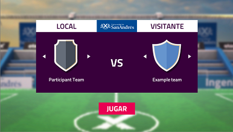
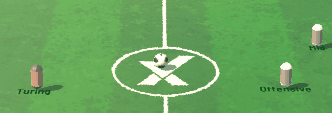
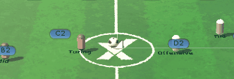
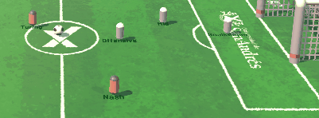

# Guía de Programación

## Probá un partido
1. Abrir el proyecto desde unity Hub haciendo doble click y esperar que cargue
2. Una vez en Unity, en la pestaña Project, navegá hasta la escena `Assets/Scenes/TeamSelection` y abrela en el editor dando doble click.
3. Clicar en el botón de play ubicado en la parte central superior del editor.   


4. Listo, deberías ver la selección de equipos y jugar un partido.



tip: en la parte superior derecha de la ventana podés apagar el audio con *Mute Audio*

## Construí tu equipo

1. Creá una copia de directorio llamado `EmptyTeam` dentro de `Assets/Teams` para crear un equipo nuevo.
2. Luego dentro de los archivos `PaticipantTeam.cs`, `Player1.cs`, `Player2.cs` y `Player3.cs` en el principio del doumento hay que cambiar el *namespace* por defecto, por el nombre que vos elijas para tu equipo:
```csharp
namespace Teams.nombre_de_tu_equipo
``` 
Para hacer esto, dentro de Unity en la pestaña project navegá hasta tu equipo y dale doble click en el codigo de `PaticipantTeam.cs` y va a abrirse automáticamente en tu IDE donde lo podrás editar.
(si no se abrió, podes configurar el IDE en *Edit > Preferences > External_Tools* como explica este [link](https://answers.unity.com/questions/1240640/how-do-i-change-the-default-script-editor.html))

### Customizá tu equipo

* Nombre: Podemos asignar el nombre del equipo en el código del mismo, modificando el valor de GetName() dentro de `PaticipantTeam.cs`
```csharp
public string GetName() => "nombre de tu equipo";
```
* Escudo: Podemos elegir uno de los escudos en `Assets/Teams/Resources/Emblems` y luego asignarlo por nombre en el código del equipo dentro de `PaticipantTeam.cs`: 
```csharp
public string TeamShield => "Orange";
```
* Color Primario: Para definir el color primario podemos definirlo en el código del equipo en la propiedad *PrimaryColor* dentro de `PaticipantTeam.cs`. Podes ayudarte con un [Selector de colores](https://htmlcolorcodes.com/es/) para elegirlo. (el color se expresa en RGB como porcentajes de 0 a 1): 
```csharp
public Color PrimaryColor => new Color(1.0f, 0.6f, 0.0f);
```

### Estructura

Dentro del directorio de equipo deberían haber 4 scripts:

- `ParticipantTeam.cs`
Este script representa la información general de tu equipo, puedes renombrar la clase y el archivo con el nombre que quieras.
 
- `PlayerOne.cs`
- `PlayerTwo.cs`
- `PlayerThree.cs`
 
Cada uno de estos representa un jugador diferente. Dentro de estos scripts encontrarás métodos que debes implementar para lograr que tus jugadores respondan de manera inteligente a lo que pasa dentro del partido.
En la sección [API](#api) de este documento encontrarás toda la información necesaria para programar a tus jugadores.

Se puede editar el nombre de cualquier jugador para que sea visible durante el partido modificando dentro de `GetPlayerDisplayName`


### Comportamientos

Te vamos a mostrar las cosas que pueden hacer los jugadores una por una para que sepas algunas de las herramientas que tenés disponibles.

Para este tutorial vas a ir modificando el equipo que creaste en [Construí tu equipo](#construí-tu-equipo) .

- Como en muchos tutoriales de programación recomendamos tipear el código en vez de hacer copy-paste para así aprenderlo mejor.

- Acordate de guardar para que los cambios que hagas surtan efecto! y luego darle play nuevamente en Unity para que esos cambios sean sumados a Unity.

	
Vamos a empezar simple, abrí el código de uno de los jugadores por ejemplo `PlayerThree.cs` y cambiale el nombre que está entre comillas.
Esto lo haces dando doble click desde unity en el código en cuestión, y va a abrirse automáticamente en tu IDE donde lo podrás editar.
```csharp
public override string GetPlayerDisplayName() => "Turing";
```
Cuando le des play en el botón de play ubicado en la parte central superior del editor y elijas tu nuevo equipo deberías ver... como no hace nada aún, pero el jugador tiene un nuevo nombre, ahora le vamos a enseñar a moverse.

Dentro de `OnUpdate` función que se ejecuta continuamente, vamos a agregar la linea `GoTo` y darle una [posición](#posición-en-el-campo) dentro de la cancha
```csharp
public override void OnUpdate()
{
 GoTo(FieldPosition.C3);
}
```
Al probarlo vas a ver como uno de los jugadores va hasta la linea central.

Si queremos que el jugador vaya hacia a pelota podemos usar `MoveBy()` que nos deja mover un jugador en una dirección.

Luego `GetDirectionTo()` nos sirve para obtener la dirección hacia una posición.

Finalmente usaremos `GetBallPosition()` que nos devuelve la posición de la pelota.
Todo junto quedará como:
```csharp
public override void OnUpdate()
{
 MoveBy(GetDirectionTo(GetBallPosition()));
}
```
Al probarlo (contra *participant team*) vas a notar como un jugador va a toda velocidad a buscar la pelota. Muy bien ya tenemos movimiento!

Ahora vamos a ver otra de las funciones, `OnReachBall()` se llama cada vez que el jugador toca la pelota.

Vamos a usar `ShootBall()` para patear la pelota, en la dirección del arco enemigo usando `GetRivalGoalPosition()`
```csharp
public override void OnReachBall()
{
	ShootBall(GetDirectionTo(GetRivalGoalPosition()),ShootForce.Medium);
}
```


Para ayudarle a uno a visualizar lo que está ocurriendo en la cancha podemos crear ayudas visuales, que encendemos arriba a la derecha de la ventana clicando en *Gizmos*

Para hacer esto vamos a usar `DrawLine()` que dibuja una linea de una posición a otra.

También podes ver que usamos `GetPosition()` que es la posición de tu propio jugador en la cancha.

(Puede que par usar las funciones *Debug* tengas que agregar la linea `using UnityEngine;` al principio del documento donde están los otros *using*)

```csharp
public override void OnReachBall()
{
	ShootBall(GetDirectionTo(GetRivalGoalPosition()),ShootForce.Medium);
	Debug.DrawLine(GetRivalGoalPosition(), GetPosition(), Color.magenta, 0.2f);
}
```
Cuando pruebes esto vas a ver como aparece una linea rosa cuando el jugador patea al arco. Hay otras funciones de debuggeo disponibles, las podes ver en la sección de [Debugging](#debugging)



Ahora vamos a hacer algo más interesante, un pase entre jugadores.

Primero vamos a abrir otro jugador y hacerle ir arriba rápidamente, de la misma manera que vimos antes:
```csharp
public override void OnUpdate()
{
	GoTo(FieldPosition.D1);
}
```
tip: podes tener varios archivos abiertos a al vez en el IDE, incluso ponerlos lado a lado si tenes un monitor grande.

Ahora vamos a volver al primer jugador que programamos y decirle que patee hacia su compañero.

Para esto usaremos `GetTeamMatesInformation()` en programación solemos empezar a contar desde el 0 así que los otros jugadores van a estar numerados como 0 y 1, podes ir probando a ver cual es el correcto en este caso es el 1 y como nos interesa la posición de el jugador-1 agregamos `.Position`

```csharp
public override void OnReachBall()
{
	ShootBall(GetDirectionTo(GetTeamMatesInformation()[1].Position),ShootForce.High);
	Debug.DrawLine(GetTeamMatesInformation()[1].Position, GetPosition(), Color.magenta, 0.5f);
}
```
Cuando lo pruebes vas a ver como un jugador se la pasa a otro. Igual que en la realidad es mas facil patear si uno está de frente a la pelota y detenido, para tenerlo en cuenta!



¿Podes hacer que el jugador de adelante la tire al arco cuando la recibe? vas a tener que modificar dentro de `OnReachBall()` de la misma manera que hicimos antes.

¿Podes hacer que el otro jugador se acerque para recibirla cuando la pelota esta cerca? Hay una función llamada `Vector3.Distance()` que te puede servir.

De la misma manera que vimos la información de los jugadores de nuestro equipo podemos hacer lo mismo con el equipo contrario usando `GetRivalsInformation()`

Si uno quiere usar Field positions como posiciones primero hay que convertirlos a *Vector3* con `GetPositionFor(FieldPosition.C2);`

Hay muchas otras funciones disponibles que dan información util o hacen cosas, las podes mirar en: [Funciones públicas](#funciones-públicas)

### Probá tu equipo

El proyecto incluye un equipo pre-armado con su código visible para poder inspirarte en el y usarlo como contrincante, este equipo se encuentran en la ruta `Assets/Teams/ExampleTeam`

Ya estás listo para crear tu propio equipo, te recomendamos empezar de "0" y pensar ¿Como me gustaría que se comporten los jugadores?¿Cuales son sus roles?¿todos hacen lo mismo?
  
## API
 
## clase TeamPlayer

 
### Funciones con posibilidad de sobreescritura
 
`OnUpdate()` -> Esta función corre constantemente, es un lugar donde podemos manejar los estados según condiciones dadas por ejemplo.
 
`OnReachBall()` -> Esta función se llama cuando el jugador toca la pelota, de esta manera, por ejemplo, podemos llamar a la función ShootBall especificando fuerza y dirección si queremos que este jugador haga un pase o disparo al arco en seguida entra en contacto con la pelota.
 
`OnScoreBoardChanged(Scoreboard)` ->  Cada vez que alguien anota un gol, esta función se llama, recibiendo el parámetro acorde. Ideal para implementar estrategias según la diferencia de goles.
 
`GetInitialPosition() : FieldPosition` -> Devuelve la posición inicial del jugador al comenzar el partido. Útil si deseas mantener formaciones defensivas. Solo está permitido usar FieldPositions como posiciones iniciales (no customizarlas), deben estar de tu lado de la cancha y estas deben ser distintas para cada jugador.
 
`GetPlayerDisplayName() : string` -> Devuelve el nombre del jugador para mostrar en el partido.
 

### Funciones públicas
Estas son todas las funciones que tenemos disponibles:
 
`float GetTimeLeft()` -> Devuelve cuánto tiempo resta de partido.
 
`TeamType GetTeamType()` -> Devuelve el tipo de equipo.
 
`int GetMyScore()` -> Devuelve tu marcador.
 
`int GetRivalScore()` -> Devuelve el marcador del rival.
 
`Vector3 GetPosition()` -> Devuelve la posición actual del jugador.
 
`Vector3 GetBallPosition()` -> Devuelve la posición actual de la pelota.
 
`Vector3 GetBallVelocity()` -> Devuelve el vector velocidad de la pelota. Con esto podemos saber que tan rápido se mueve y hacia donde, nos permite hacer cálculos de trayectoria.
 
`Vector3 GetDirectionTo(Vector3)` -> Calcula la dirección hacia una posición dada.
 
`Vector3 GetPositionFor(FieldPosition)` -> Retorna la posición de un cuadrante dado.
 
`void GoTo(FieldPosition)` -> Mueve al jugador hacia el cuadrante específico y se detiene al llegar al mismo.
 
`void MoveBy(Vector3)` -> Mueve al jugador en la dirección dada.
 
`Vector3 GetRivalGoalPosition()` -> Devuelve la posición del arco rival.
 
`Vector3 GetMyGoalPosition()` -> Devuelve la posición del arco propio.
 
`PlayerDTO GetTeamMatesInformation()` -> Devuelve posición, dirección, y velocidad de tus jugadores.
 
`PlayerDTO GetRivalsInformation()` -> Devuelve posición, dirección, y velocidad de los jugadores rivales.

`void ShootBall(Vector3, ShootForce)` -> Patear la pelota en un dirección dada con una fuerza dada.
 
`void Stop()` -> Detiene el jugador donde está parado.
 
`string ToString()` -> Imprime la posición, dirección y velocidad del jugador en la consola de unity.
 

### Otras funciones útiles

[Mathf](https://docs.unity3d.com/ScriptReference/Mathf.html) tiene muchas funciones para hacer cálculos trigonométricos 

[Vector3](https://docs.unity3d.com/ScriptReference/Vector3.html) tiene muchas funciones para cálculos vectoriales 

## Interfaces
 
### Posición en el campo
 
Interfaz que ayuda a posicionar a los jugadores en el campo:
 

 
### Fuerza de tiro
 
Es posible que tengas que hacer un pase preciso, para eso podemos darle diferente intensidad a los tiros:
 
```csharp
public enum ShootForce
{
   Low = 100, Medium = 450, High = 800
}
```
 
## Debugging

Para ayudar al debuggeo hay disponibles alguna funciones adicionales que permiten imprimir el valor de las variables y otros mensajes.
Todas estos mensajes aparecen en la console de Unity, es una de las pestañas de abajo que dice console, al lado de projects.
(Puede que para usar las funciones *Debug* tengas que agregar la linea `using UnityEngine;` al principio del documento donde estan los otros *using*)

```csharp
Debug.Log("aquí va un mensaje");
Debug.Log("Ball direction:" + ballVelocity.ToString());
```
Esta funcion dentro de uno de los jugadores imprime posición, direcciónn y velocidad de ese jugador:
```csharp
Debug.Log(ToString()); 
```
Así como tambien dibujar lineas de guía (presionar el botón Gizmos en la parte superior derecha de la ventana para verlos):
```csharp
Debug.DrawLine(GetRivalGoalPosition(), GetPosition(), Color.magenta, 0.5f);
```
recibe: Vector3 start, Vector3 end, Color, Float duration
```csharp
Debug.DrawRay(GetPosition(), GetDirectionTo(ballPosition), Color.blue, 0.2f);
```
recibe: Vector3 start, Vector3 dir, Color, Float duration
     
## Ejemplos
 
Mover el jugador hacia la pelota:
 
```csharp
public override void OnUpdate()
{
   var ballPosition = GetBallPosition();
   var directionToBall = GetDirectionTo(ballPosition);
   MoveBy(directionToBall);   
}
```
 
Si el jugador esta cerca de la pelota, moverlo hacia la misma y si no, pararse cerca de la posición A2 (posicion defensiva):
 
```csharp
public override void OnUpdate()
{
   var ballPosition = GetBallPosition();
   if (Vector3.Distance(ballPosition, GetMyGoalPosition()) < 5) // 5 meters in unity units
   {
       MoveBy(GetDirectionTo(ballPosition));
   }
   else
   {
       GoTo(FieldPosition.A2);
   }
}
```
 
Disparar hacia el arco opuesto:
 
```csharp
public override void OnReachBall()
{
   var rivalGoalPosition = GetRivalGoalPosition();
   var directionToRivaGoal = GetDirectionTo(rivalGoalPosition);
   ShootBall(directionToRivaGoal, ShootForce.High);
}
```
 
Hacer algo según el marcador:
 
```csharp
public override void OnScoreBoardChanged(ScoreBoard scoreBoard)
{
   if (scoreBoard.My < scoreBoard.Rival)
   {
       // losing
   }
   else if (scoreBoard.My == scoreBoard.Rival)
   {
       // drawing
   }
   else
   {
       // winning
   }
}
```
 

## Tutorial C#

Para programar en Unity se usa el lenguaje de programación [C#](https://es.wikipedia.org/wiki/C_Sharp).

El tutor te va a ayudar con todas las duda que tengas de como convertir tu idea de estrategia a código de máquina. Pero es recomendable intentar aprender lo más posible del lenguaje para no depender del tutor 100%, a continuación presentamos algunos tutoriales para empezar:

[Curso en Español](https://youtube.com/playlist?list=PLAzlSdU-KYwULKOjG-OxSZ2WCXiz05Ikz) completo para principiante con videos de 10 min 

[Tutorial en Español](https://youtu.be/6W2wYwHQNT4) para principiantes 5hs

[Tutorial en Ingles](https://youtu.be/gfkTfcpWqAY?t=1125) explica un poco de variables, sintaxis y operadores

