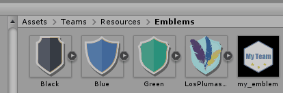
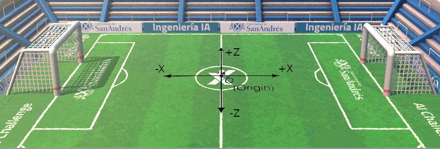
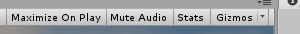
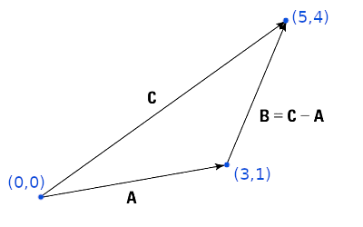

# Guía de Programación 

Acá está un tutorial resumido en forma de [video](https://www.youtube.com/watch?v=yECP6mX871k).  

## Descargá el Juego
1. Descargar este repositorio de GitHub clicando "Code" y después "Download ZIP" en la esquina superior derecha del [directorio raiz](https://github.com/UDESA-AI/AI-Challenge).   

2. Descomprimir el archivo *.zip* y guardarlo en una carpeta.
3. En UnityHub en la pestaña Projects clicar "Add" y buscar la carpeta del proyecto `AI-Challenge-master`.

## Probá un partido
1. Abrir el proyecto *AI-Challenge* desde unity Hub haciendo doble click y esperar que cargue.
2. Una vez en Unity, en la pestaña Project, navegá hasta la carpeta `Assets/Scenes/`, luego hacé doble click en el ícono de Unity que dice `TeamSelection`. 
3. Luego clickeá el botón de *play* ubicado en la parte central superior del editor.   


4. Listo, deberías ver la selección de equipos.  Elegí los equipos que queres que juegen, y apretá el botón "Jugar". El partido debería arrancar!


Tip: en la parte superior derecha de la ventana podés apagar el audio con *Mute Audio*

## Construí tu equipo
Aquí tenés dos opciones, empezar de un equipo base ó empezar de 0 con tus ideas:
- Equipo base:
1. Creá una copia del directorio llamado `ExampleTeam` dentro de `Assets/Teams` para crear un equipo nuevo.
- Equipo en blanco:
1. Creá una copia del directorio llamado `EmptyTeam` dentro de `Assets/Teams` para crear un equipo nuevo.
2. Luego dentro de los archivos `ParticipantTeam.cs`, `Player1.cs`, `Player2.cs` y `Player3.cs` en el principio del doumento hay que cambiar el *namespace* por defecto, por el nombre que vos elijas para tu equipo:
```csharp
namespace Teams.nombre_de_tu_equipo
``` 

Para hacer esto, dentro de Unity en la pestaña project navegá hasta tu equipo y dale doble click en el codigo de `PaticipantTeam.cs` y va a abrirse automáticamente en tu IDE donde lo podrás editar.
(si no se abrió, podes configurar el IDE en *Edit > Preferences > External_Tools* como explica este [link](https://answers.unity.com/questions/1240640/how-do-i-change-the-default-script-editor.html))

## Customizá tu equipo

* Nombre: Podemos asignar el nombre del equipo en el código del mismo, modificando el valor de GetName() dentro de `PaticipantTeam.cs`:

```csharp
public string GetName() => "nombre de tu equipo";
```
* Escudo: Podemos importar un *.png* a gusto (250x250 pixeles) en la ruta `Assets/Teams/Resources/Emblems` y luego asignarlo por nombre en el código del equipo:
```csharp
public string TeamShield => "nombre_de_la_imagen";
```
Se lo debe configurar como un *Sprite* en el Inspector de Unity para que el juego lo reconozca.



* Color Primario: Para definir el color primario podemos definirlo en el código del equipo en la propiedad *PrimaryColor* dentro de `ParticipantTeam.cs`. Podes ayudarte con un [Selector de colores](https://htmlcolorcodes.com/es/) para elegirlo. (el color se expresa en RGB como porcentajes de 0 a 1): 

```csharp
public Color PrimaryColor => new Color(1.0f, 0.6f, 0.0f);
```

## Estructura del código

Dentro del directorio de equipo deberían haber 4 scripts:

- `ParticipantTeam.cs` 

Este script representa la información general de tu equipo. Puedes renombrar el archivo y la clase con el nombre que quieras.

- `PlayerOne.cs`
- `PlayerTwo.cs`
- `PlayerThree.cs`
 
Cada uno de estos representa un jugador diferente. Dentro de estos tres scripts deberás programar el comportamiento de cada jugador!

En la sección [Funciones disponibles](#funciones-disponibles) de este documento encontrarás una lista de funciones que podrás utilizar para programar a tus jugadores. 


## Dale vida a un jugador

Te vamos a mostrar ejemplos de las cosas que pueden hacer los jugadores para que veas algunas de las herramientas que tenés disponibles.

Para este tutorial vas a ir modificando el equipo que creaste en [Construí tu equipo](#construí-tu-equipo).

**Nota:** para este mini-tutorial lo ideal es jugar contra el equipo Empty Team, ya que este no tiene comportamiento y todos sus jugadores se quedan quietos.

Tips:

- Como en muchos tutoriales de programación, recomendamos que escribas el código vos mismo, en lugar de hacer copy-paste, ya que así aprenderás mejor y más rápido! 

- Acordate de guardar los cambios para que estos surtan efecto! Luego de guardar los cambios, podes apratar Play nuevamente en Unity para que esos cambios sean sumados a Unity.


### Cambiale el nombre al jugador 
Vamos a empezar de manera sencilla. Abrí el código de uno de los jugadores, por ejemplo `PlayerThree.cs`, y cambiale el nombre del jugador por "Maradona".
Esto lo haces dando doble click desde unity en el código en cuestión, y va a abrirse automáticamente en tu IDE donde lo podrás editar.

Cambiá el text que va después de `GetPlayerDisplayName() =>`:

```csharp
public override string GetPlayerDisplayName() => "Maradona";
```

Guardá los cambios y luego apretá el botón Play ubicado en la parte central superior de Unity.  Luego elegí tu nuevo equipo y apretá el botón "Jugar". Si bien el quipo aún no hace nada, deberías notar que uno de los jugadores tiene el nombre "Maradona". Yay!

### Movimiento de un jugador

Ahora le vamos a enseñar a moverse ;)

#### GoTo( )
Dentro de la función `OnUpdate`, función que se ejecuta continuamente, vamos a agregar la linea `GoTo` e indicarle que queremos que vaya a la posición **C3** en la cancha (ver el  [mapa de posiciones estandarizadas](#posición-en-el-campo) dentro de la cancha):

```csharp
public override void OnUpdate()
{
 GoTo(FieldPosition.C3);
}
```

Al probarlo vas a ver como uno de los jugadores va hasta el punto central de la cancha. 

#### MoveBy( )

Si queremos que el jugador vaya hacia la pelota podemos usar en vez `MoveBy()`, que nos deja mover un jugador en una dirección.

Luego `GetDirectionTo()` nos sirve para obtener la dirección hacia una posición (desde la posición actual del jugador).

Finalmente usaremos `GetBallPosition()` que nos devuelve la posición de la pelota.

Todo junto quedará como:

```csharp
public override void OnUpdate()
{
 var ballPosition = GetBallPosition();
 var directionToBall = GetDirectionTo(ballPosition);
 MoveBy(directionToBall);
}
```

Al probarlo (contra *participant team*) vas a notar como el jugador "Maradona" va a toda velocidad a buscar la pelota. Muy bien, ya tenemos movimiento!

**Nota:** También se puede usar `GoTo()` para esto, se te ocurre como?

### Pegarle a la pelota

Cada vez que el jugador toca la pelota se ejecuta el código que está adentro de la función `OnReachBall()`.

Vamos a usar `ShootBall()` para patear la pelota. En este caso patearemos en la dirección del arco enemigo usando `GetRivalGoalPosition()`, que nos devuelve la posición del arco del rival.

```csharp
public override void OnReachBall()
{
	var rivalGoalPosition = GetRivalGoalPosition();
	var rivalGoalDirection = GetDirectionTo(rivalGoalPosition);
	ShootBall(rivalGoalDirection, ShootForce.Medium);
}
```


### Pasarle la pelota a un compañero

Ahora vamos a hacer algo más interesante, un pase entre jugadores.

Primero vamos a abrir el archivo `PlayerTwo.cs` (archivo correspondiente al segundo jugador) y hacerle ir a una posición cerca del arco rival, utilizando la función ```GoTo()```, como vimos antes. En este caso, lo movemos a la posición D1 (ver [mapa de posiciones](#posición-en-el-campo)). 

```csharp
public override void OnUpdate()
{
	GoTo(FieldPosition.D1);
}
```

Tip: podes tener varios archivos abiertos a al vez en el IDE, incluso ponerlos lado a lado si tenes un monitor grande.

Ahora vamos a volver al primer jugador que programamos y decirle que patee hacia su compañero.

Para esto usaremos `GetTeamMatesInformation()`. Recordá que en programación solemos empezar a contar desde el 0 así que los otros jugadores van a estar numerados 0 y 1, ordenados siguiendo el orden alfabético. En este caso es `PlayerTwo` es el 1 y como nos interesa la posición de el jugador agregamos `.Position`

```csharp
public override void OnReachBall()
{
	var playerTwoPosition = GetDirectionTo(GetTeamMatesInformation()[1].Position;
	var directionToPlayerTwo = GetDirectionTo(playerTwoPosition)
	ShootBall(directionToPlayerTwo, ShootForce.High);
}
```
Cuando lo pruebes vas a ver como un jugador se la pasa a otro. 


### Penales
TODO: Explicar aleatoridad. Mostrar codigo.
En caso de empate, el partido pasa a los penales.


### ¿Y ahora...?

¿Podes hacer que el jugador de adelante patee al arco cuando la recibe? Vas a tener que modificar algo dentro de `OnReachBall()`, de la misma manera que hicimos antes.

¿Podes hacer que el otro jugador se acerque para recibirla cuando la pelota esta cerca? Hay una función llamada `Vector3.Distance()` que te puede servir.

De la misma manera que vimos la información de los jugadores de nuestro equipo podemos hacer lo mismo con el equipo contrario usando `GetRivalsInformation()`

Si uno quiere usar los [**FieldPositions**](#posición-en-el-campo) como posiciones, primero hay que convertirlos a *Vector3* con `GetPositionFor(FieldPosition.C2);`

Hay muchas otras funciones disponibles que dan información util o hacen cosas, las podes mirar en: [Funciones públicas](#funciones-públicas)

## Probá tu equipo!

El proyecto incluye un equipo pre-armado con su código visible para poder inspirarte en el y usarlo como contrincante, este equipo se encuentran en la ruta `Assets/Teams/ExampleTeam`

Además hay 5 otros equipos mas avanzados contra los que jugar.
|Nombre|Descripción|
|---|---|
|Pollotrones|Cualquier parecido con Example team es mera coincidencia, dificil de cofundirlo con estrategias baratas|
|Los plumas|¿Quien esperaba que 3 pájaros nos dieran un partido tán dinámico?|
|Defensores de Nacho|Cuidado con el GARRAFA siempre está listo para metér gol, y sus amigos para pasar la pelota|
|LOTR|La coordianción entre estos elfos y humanos es impresionante, dificil sacarles la pelota una vez que la consiguen|
|LAR team|Cuidado con darle una ventana de tiempo donde vean tu arco, este esquipo está buscando siempre el mejor momento para patear|


Ya estás listo para crear tu propio equipo, te recomendamos empezar de "0" y pensar ¿Como me gustaría que se comporten los jugadores?¿Cuales son sus roles?¿todos hacen lo mismo?
  
## Funciones disponibles
 
### Funciones dentro del código de cada jugador (por ejemplo `PlayerOne.cs`)
 
`OnUpdate()` -> Esta función corre constantemente. Es un lugar donde podemos manejar los estados según condiciones dadas por ejemplo.
 
`OnReachBall()` -> Esta función se ejecuta solamente cuando el jugador toca la pelota. De esta manera, por ejemplo, podemos llamar a la función ShootBall cuando toca la pelota, especificando fuerza y dirección si queremos que este jugador haga un pase o disparo al arco, etc.
 
`OnScoreBoardChanged(Scoreboard)` ->  Cada vez que alguien anota un gol, esta función se llama, recibiendo el parámetro acorde. Ideal para implementar estrategias según la diferencia de goles.
 
`GetInitialPosition() : FieldPosition` -> Devuelve la posición inicial del jugador al comenzar el partido. En esta función indicamos donde empieza el partido el jugador, se debe elegir una de estas 9 [posiciones](#posición-en-el-campo): *A1, A2, A3, B1, B2, B3, C1, C2, C3*  y esta debe ser distinta para cada jugador del equipo.
 
`GetPlayerDisplayName() : string` -> Define el nombre que se verá debajo de cada jugador durante el partido.
 

### Funciones públicas

Estas son todas las funciones que tenemos disponibles:
 
`float GetTimeLeft()` -> Devuelve cuánto tiempo resta de partido.
 
`TeamType GetTeamType()` -> Devuelve el tipo de equipo.
 
`int GetMyScore()` -> Devuelve tu marcador.
 
`int GetRivalScore()` -> Devuelve el marcador del rival.
 
`Vector3 GetPosition()` -> Devuelve la posición actual del jugador.
 
`Vector3 GetBallPosition()` -> Devuelve la posición actual de la pelota.
 
`Vector3 GetBallVelocity()` -> Devuelve el vector velocidad de la pelota. Con esto podemos saber que tan rápido se mueve y hacia donde, nos permite hacer cálculos de trayectoria.
 
`Vector3 GetDirectionTo(Vector3)` -> Calcula la dirección desde el jugador hacia una posición dada.
 
`Vector3 GetPositionFor(FieldPosition)` -> Retorna la posición de una [cuadrante (*FieldPosition*)](#posición-en-el-campo) dada.
 
`void GoTo(FieldPosition)` -> Mueve al jugador hacia el [cuadrante (*FieldPosition*)](#posición-en-el-campo) específico y se detiene al llegar al mismo.

`void GoTo(Vector3)` -> Mueve al jugador hacia una posición dada y se detiene al llegar al mismo.
 
`void MoveBy(Vector3)` -> Mueve al jugador en la dirección dada.
 
`Vector3 GetRivalGoalPosition()` -> Devuelve la posición del centro del arco rival.
 
`Vector3 GetMyGoalPosition()` -> Devuelve la posición del centro del arco propio.
 
`PlayerDTO GetTeamMatesInformation()` -> Devuelve posición, dirección, y velocidad de tus jugadores.
 
`PlayerDTO GetRivalsInformation()` -> Devuelve posición, dirección, y velocidad de los jugadores rivales.

`void ShootBall(Vector3, ShootForce)` -> Patear la pelota en un dirección dada con una fuerza dada.
 
`void Stop()` -> Detiene el jugador donde está parado.
 
`string ToString()` -> Imprime la posición, dirección y velocidad del jugador en la consola de unity.
 

### Otras funciones útiles

[Mathf:](https://docs.unity3d.com/ScriptReference/Mathf.html) tiene muchas funciones para hacer cálculos trigonométricos 

[Vector3:](https://docs.unity3d.com/ScriptReference/Vector3.html) tiene muchas funciones para cálculos vectoriales 

Normalizar(magnitud 1) una dirección
```csharp
using UnityEngine;
```
```csharp
var normalizedDirection = Vector3.Normalize(direction);
```


[HandleUtility:](https://docs.unity3d.com/ScriptReference/HandleUtility.html) tiene muchas funciones geometricas de ayuda como la intersección entre un punto y una linea

Obtener la distancia del jugador a la linea imagianria entre la pelota y el arco:
```csharp
using UnityEditor;
```
```csharp
var distance2BallPath = HandleUtility.DistancePointLine(GetPosition(),GetBallPosition(),GetMyGoalPosition());
```

## Posición en el campo
 
Interfaz que ayuda a posicionar a los jugadores en el campo:
 


## Coordenadas

El area de juego mide aproximadamnte 20 x 20, es decir que los limites de la cancha están en:
 - 10 y -10 en X
 - 10 y -10 en Z

**Nota Importante:** los equipos deben poder usarse de ambos lados de la cancha, no escribir funciones que usen coordenas absolutas y por lo tanto solo funcionen de un lado de la cancha.
  

 
## Fuerza de tiro
 
Es posible que tengas que hacer un pase preciso, para eso podemos darle diferente intensidad a los tiros:
 
```csharp
public enum ShootForce
{
   Low = 100, Medium = 450, High = 800
}
```
 
## Debugging

### Visualizar

Para ayudarle a uno a visualizar lo que está ocurriendo en la cancha podemos crear ayudas visuales, que encendemos arriba a la derecha de la ventana clicando en *Gizmos*


Para hacer esto vamos a usar `DrawLine()` que dibuja una linea de una posición a otra.

También podes ver que usamos `GetPosition()` que es la posición de tu propio jugador en la cancha.

**Nota:** Para usar las funciones *Debug* hace falta tener la linea `using UnityEngine;` al principio del documento donde están los otros *using*
```csharp
using UnityEngine;
```
```csharp
public override void OnReachBall()
{
	ShootBall(GetDirectionTo(GetRivalGoalPosition()),ShootForce.Medium);
	Debug.DrawLine(GetRivalGoalPosition(), GetPosition(), Color.magenta, 0.2f);
}
```
Cuando pruebes esto vas a ver como aparece una linea rosa cuando el jugador patea al arco.


### Escribir mensajes a la consola

Para ayudar al debuggeo hay disponibles alguna funciones adicionales que permiten imprimir el valor de las variables y otros mensajes.
Todas estos mensajes aparecen en la console de Unity, es una de las pestañas de abajo que dice console, al lado de projects.
(Puede que para usar las funciones *Debug* tengas que agregar la linea `using UnityEngine;` al principio del documento donde estan los otros *using*)

```csharp
Debug.Log("aquí va un mensaje");
Debug.Log("Ball direction:" + ballVelocity.ToString());
```
Esta funcion dentro de uno de los jugadores imprime posición, direcciónn y velocidad de ese jugador:
```csharp
Debug.Log(ToString()); 
```
Así como tambien dibujar lineas de guía, que encendemos arriba a la derecha de la ventana clicando en *Gizmos*
:
```csharp
Debug.DrawLine(GetRivalGoalPosition(), GetPosition(), Color.magenta, 0.5f);
```
recibe: Vector3 start, Vector3 end, Color, Float duration
```csharp
Debug.DrawRay(GetPosition(), GetDirectionTo(ballPosition), Color.blue, 0.2f);
```
recibe: Vector3 start, Vector3 dir, Color, Float duration

## Vectores

La presente sección muestra como realizar el cálculo de un vector que describe la dirección entre dos puntos.

Para esto, supongamos que tenemos los 3 puntos que se muestran en la imagen siguiente. 

Estos son:
- El origen: (x<sub>0</sub>, y<sub>0</sub>, z<sub>0</sub>) = (0, 0, 0)
- Punto 1: (x<sub>1</sub>, y<sub>1</sub>, z<sub>1</sub>) = (3, 0, 1)
- Punto 2: (x<sub>2</sub>, y<sub>2</sub>, z<sub>2</sub>) = (5, 0, 4)



Para definir un vector entre dos puntos: (x<sub>1</sub>, y<sub>1</sub>, z<sub>1</sub>) y (x<sub>2</sub>, y<sub>2</sub>, z<sub>2</sub>)

Lo hacemos restando componente a componente: Vector = (x<sub>2</sub>-x<sub>1</sub> , y<sub>2</sub>-y<sub>1</sub> , z<sub>2</sub>-z<sub>1</sub>)

En este caso nos interesa conocer la dirección del punto 2 respecto al punto 1 (vector **B**). Esto lo podemos hacer de la siguiente manera:

Vector **B** = (x<sub>2</sub>-x<sub>1</sub> , y<sub>2</sub>-y<sub>1</sub> , z<sub>2</sub>-z<sub>1</sub>) = (5-3, 0-0, 4-1) = (2, 0, 3) 

Las coordenadas del punto 1 respecto al origen: (3, 0, 1), están determinadas por el vector **A** que parte del origen. Lo mismo ocurre con el punto 2, en donde su ubicación respecto al origen esta definida por el vector **C**. 

Por lo tanto, el calculo del vector B se puede calcular de la siguiente forma:

Vector **B** = vector **C** - vector **A** = (5, 0, 4) - (3, 0, 1) = (5-3, 0-0, 4-1) = (2, 0, 3)

Para hacer el cálculo en C#:
```csharp
var vectorA = new Vector3(3.0f, 0.0f, 1.0f);
var vectorC = new Vector3(5.0f, 0.0f, 4.0f);
var vectorB = vectorC - vectorA;
```

## Ejemplos
 
Mover el jugador hacia la pelota:
 
```csharp
public override void OnUpdate()
{
   var ballPosition = GetBallPosition();
   var directionToBall = GetDirectionTo(ballPosition);
   MoveBy(directionToBall);   
}
```
 
Si la pelota esta cerca del arco, moverse hacia la misma y si no, pararse cerca de la posición A2 (posicion defensiva):
 
```csharp
public override void OnUpdate()
{
   var ballPosition = GetBallPosition();
   if (Vector3.Distance(ballPosition, GetMyGoalPosition()) < 5) // 5 meters in unity units
   {
       MoveBy(GetDirectionTo(ballPosition));
   }
   else
   {
       GoTo(FieldPosition.A2);
   }
}
```
 
Disparar hacia el arco opuesto:
 
```csharp
public override void OnReachBall()
{
   var rivalGoalPosition = GetRivalGoalPosition();
   var directionToRivaGoal = GetDirectionTo(rivalGoalPosition);
   ShootBall(directionToRivaGoal, ShootForce.High);
}
```
 
Hacer algo según el marcador:
 
```csharp
public override void OnScoreBoardChanged(ScoreBoard scoreBoard)
{
   if (scoreBoard.My < scoreBoard.Rival)
   {
       // losing
   }
   else if (scoreBoard.My == scoreBoard.Rival)
   {
       // drawing
   }
   else
   {
       // winning
   }
}
```
 
Obtener la distancia de la pelota a la recta imaginaria entre el jugador y el arco:
 
```csharp
var startingPoint = GetPosition();
var direction = GetDirectionTo(GetRivalGoalPosition());
var point = GetBallPosition();

Ray ray = new Ray(startingPoint, Vector3.Normalize(direction));
float distance = Vector3.Cross(ray.direction, point - ray.origin).magnitude;
```

## Tutorial C#

Para programar en Unity se usa el lenguaje de programación [C#](https://es.wikipedia.org/wiki/C_Sharp).

El tutor te va a ayudar con todas las duda que tengas de como convertir tu idea de estrategia a código de máquina. Pero es recomendable intentar aprender lo más posible del lenguaje para no depender del tutor 100%, a continuación presentamos algunos tutoriales para empezar:

[Curso en Español](https://youtube.com/playlist?list=PLAzlSdU-KYwULKOjG-OxSZ2WCXiz05Ikz) completo para principiante con videos de 10 min 

[Tutorial en Español](https://youtu.be/6W2wYwHQNT4) para principiantes 5hs

[Tutorial en Ingles](https://youtu.be/gfkTfcpWqAY?t=1125) explica un poco de variables, sintaxis y operadores

