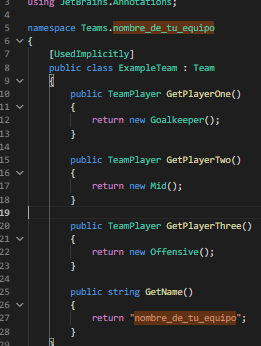

# Guía de Programación

## Probá un partido
1. Abrir el proyecto desde unity Hub haciendo doble click y esperar que cargue
2. Una vez en Unity, en la pestaña Project, navegá hasta la escena `Assets/Scenes/Application` y abrela en el editor dando doble click.
3. Clicar en el botón de play ubicado en la parte central superior del editor
4. Listo, deberias ver la seleción de equipos
 
tip: en la parte superior derecha de la ventana podés apagar el audio, encender los gizmos y otras cosas.

## Construí tu equipo

1. Creá una copia de directorio llamado `ParticipantTeam` dentro de `Assets/Teams` para crear un equipo nuevo.
2. Luego dentro de PaticipantTeam.cs hay que cambiar el nombre default por el que elijas para tu equipo como se ve en la imagen:
   


3. Luego dentro de `Offensive.cs`, `mid.cs` y `Goalkeeper.cs` se debe cambiar el *namespace* de la misma manera.

Además de esto, necesitamos definir algunas características del equipo:
* Nombre: Podemos asignar el nombre del equipo en el código del mismo, modificando el valor de GetName() como se ve en la image de arriba
* Escudo: Podemos importar un png a gusto en la ruta `Assets/Teams/Resources/Emblems` y luego asignarlo por nombre en el código del equipo.
* Color Primario: Para definir el color primario podemos definirlo en el código del equipo en la propiedad PrimaryColor. Para definir un nuevo color desde los valores RGB podemos usar el constructor new Color(float r, float g, float b). Podes ayudarte con un [Selector de colores](https://htmlcolorcodes.com/es/) para elegirlo.
  
Si bién no es nesesario, también es buena idea cambiar el nombre de los scripts y la carpeta contenedora, para mantener el orden.


El proyecto incluye un equipo pre-armado con su código visible para poder inspirarte en el y usarlo como contrincante, este equipo se encuentran en la ruta `Assets/Teams/ExampleTeam`

Dentro del directorio de equipo deberían haber 4 scripts:
- `ExampleTeam.cs`
Este script representa la información general de tu equipo, puedes renombrar la clase y el archivo con el nombre que quieras.
 
- `PlayerOne.cs`
- `PlayerTwo.cs`
- `PlayerThree.cs`
 
Cada uno de estos representa un jugador diferente. Dentro de estos scripts encontrarás métodos que debes implementar para lograr que tus jugadores respondan de manera inteligente a lo que pasa dentro del partido.
En la sección [API](#api) de este documento encontrarás toda la información necesaria para programar a tus jugadores.
Se puede editar el nombre de cualquier jugador para que sea visible durante el partido.
  
 
## API
 
## clase TeamPlayer

 
### Funciones con posibilidad de sobreescritura
 
`OnUpdate()` -> Esta función corre constantemente, es un lugar donde podemos manejar los estados según condiciones dadas por ejemplo.
 
`OnReachBall()` -> Esta función se llama cuando el jugador toca la pelota, de esta manera, por ejemplo, podemos llamar a la función ShootBall especificando fuerza y direccion si queremos que este jugador haga un pase o disparo al arco en seguida entra en contacto con la pelota.
 
`OnScoreBoardChanged(Scoreboard)` ->  Cada vez que alguien anota un gol, esta función se llama, recibiendo el parámetro acorde. Ideal para implementar estrategias según la diferencia de goles.
 
`GetInitialPosition() : FieldPosition` -> Devuelve la posición inicial del jugador al comenzar el partido. Útil si deseas mantener formaciones defensivas. Solo está permitido usar FieldPositions como posiciones iniciales (no customizarlas), y estas deben ser distintas para cada jugador.
 
`GetPlayerDisplayName() : string` -> Devuelve el nombre del jugador para mostrar en el partido.
 

### Funciones públicas
Estas son todas las funciones que tenemos disponibles 
 
`float GetTimeLeft()` -> Devuelve cuánto tiempo resta de partido.
 
`TeamType GetTeamType()` -> Devuelve el tipo de equipo.
 
`int GetMyScore()` -> Devuelve tu marcador.
 
`int GetRivalScore()` -> Devuelve el marcador del rival.
 
`Vector3 GetPosition()` -> Devuelve la posición actual del jugador.
 
`Vector3 GetBallPosition()` -> Devuelve la posición actual de la pelota.
 
`Vector3 GetBallVelocity()` -> Devuelve el vector velocidad de la pelota. Con esto podemos saber que tan rápido se mueve y hacia donde, nos permite hacer cálculos de trayectoria.
 
`Vector3 GetDirectionTo(Vector3)` -> Calcula la dirección hacia una posición dada.
 
`Vector3 GetPositionFor(FieldPosition)` -> Retorna la posición de un cuadrante dado.
 
`void GoTo(FieldPosition)` -> Mueve al jugador hacia el cuadrante específico y se detiene al llegar al mismo.
 
`void MoveBy(Vector3)` -> Mueve al jugador en la dirección dada.
 
`Vector3 GetRivalGoalPosition()` -> Devuelve la posición del arco rival.
 
`Vector3 GetMyGoalPosition()` -> Devuelve la posición del arco propio.
 
`PlayerDTO GetTeamMatesInformation()` -> Devuelve posición, dirección, y velocidad de tus jugadores.
 
`PlayerDTO GetRivalsInformation()` -> Devuelve posición, dirección, y velocidad de los jugadores rivales.
 
`void Stop()` -> Detiene el jugador donde está parado.
 
`string ToString()` -> Imprime la posición, dirección y velocidad del jugador en la consola de unity.
 

### Otras funciones útiles

[Mathf](https://docs.unity3d.com/ScriptReference/Mathf.html) tiene muchas funciones para hacer càlculos trigonometricos 

[Vector3](https://docs.unity3d.com/ScriptReference/Vector3.html) tiene muchas funciones para cálculos vectoriales 

## Interfaces
 
### Posición en el campo
 
Interfaz que ayuda a posicionar a los jugadores en el campo:
 

 
### Fuerza de tiro
 
Es posible que tengas que hacer un pase preciso, para eso podemos darle diferente intensidad a los tiros:
 
```csharp
public enum ShootForce
{
   Low = 100, Medium = 450, High = 800
}
```
 
## Ejemplos
 
Mover el jugador hacia la pelota:
 
```csharp
public override void OnUpdate()
{
   var ballPosition = GetBallPosition();
   var directionToBall = GetDirectionTo(ballPosition);
   MoveBy(directionToBall);   
}
```
 
Si el jugador esta cerca de la pelota, moverlo hacia la misma y si no, pararse cerca de la posición A2 (posicion defensiva):
 
```csharp
public override void OnUpdate()
{
   var ballPosition = GetBallPosition();
   if (Vector3.Distance(ballPosition, GetMyGoalPosition()) < 5) // 5 meters in unity units
   {
       MoveBy(GetDirectionTo(ballPosition));
   }
   else
   {
       GoTo(FieldPosition.A2);
   }
}
```
 
Disparar hacia el arco opuesto:
 
```csharp
public override void OnReachBall()
{
   var rivalGoalPosition = GetRivalGoalPosition();
   var directionToRivaGoal = GetDirectionTo(rivalGoalPosition);
   ShootBall(directionToRivaGoal, ShootForce.High);
}
```
 
Hacer algo según el marcador:
 
```csharp
public override void OnScoreBoardChanged(ScoreBoard scoreBoard)
{
   if (scoreBoard.My < scoreBoard.Rival)
   {
       // losing
   }
   else if (scoreBoard.My == scoreBoard.Rival)
   {
       // drawing
   }
   else
   {
       // winning
   }
}
```
 
## Tutorial C#

Para programar en Unity se usa el lenguaje de programación [C#](https://es.wikipedia.org/wiki/C_Sharp).

El tutor te va a ayudar con todas las duda que tengas de como convertir tu idea de estrategia a código de máquina. Pero es recomendable intentar aprender lo más posible del lenguaje para no depender del tutor 100%, a continuación presentamos algunos tutoriales para empezar:

[Tutorial en Español](https://youtu.be/6W2wYwHQNT4) para principiantes

[Tutorial en Ingles](https://youtu.be/gfkTfcpWqAY?t=1125) explica un poco de variables, sintaxis y operadores

